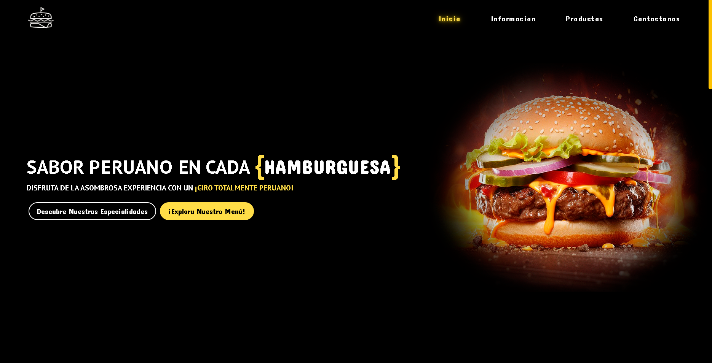

# Página Web de Venta de Hamburguesas - Maqueta

Este proyecto es una maqueta de una página web para la venta de hamburguesas, desarrollada en un período de **3 días**. El proyecto aún está incompleto y le faltan algunas funcionalidades. Es ideal para futuros desarrolladores que deseen continuar con su desarrollo y añadir las funcionalidades faltantes.

## Secciones de la Página

- **Inicio**: Página principal con una introducción básica.
- **Información**: Detalles sobre la venta de hamburguesas y la empresa.
- **Productos**: Lista de hamburguesas disponibles para la venta.
- **Contáctanos**: Sección en desarrollo, pensada para futuros desarrolladores.

## Características

- Esta maqueta presenta la estructura principal de la página, pero actualmente los **botones no redirigen** a ninguna funcionalidad ni página específica.
- La **sección de Contáctanos** aún no está finalizada, por lo que queda abierta para que futuros desarrolladores la completen.

## Estructura del Proyecto

```bash
HAMBURGUESA/
├── css/
│   └── index.css       # Archivo de estilos CSS para la apariencia visual.
├── js/
│   └── index.js        # Archivo JavaScript (sin funcionalidad activa).
└── index.html          # Página principal que contiene toda la estructura.
```

## Screenshots del Modelo
